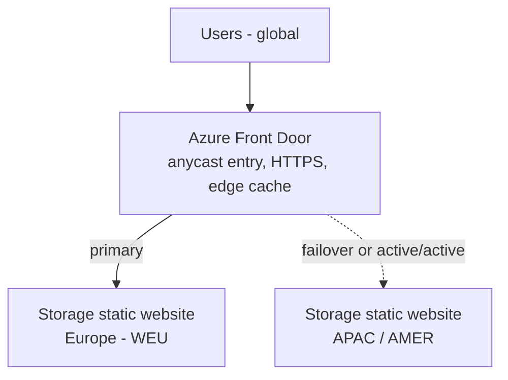

# Azure Front Door in front of Storage static websites

Template: [frontdoor.bicep](frontdoor.bicep) with parameters in [frontdoor.bicepparam](frontdoor.bicepparam).

## Architecture



Each origin is a separate storage account with static website enabled (see [../static-site/static-site.bicep](../static-site/static-site.bicep)), with the same content uploaded to each one.

## What the template creates

- Front Door Standard or Premium profile and one endpoint.
- One origin group (`static-site`) with an origin per static website hostname passed in `origins`.
- One route (`/*`) with HTTP to HTTPS redirect, HTTPS-only forwarding to the origin, and compression.
- Optional custom domain with a Front Door managed certificate (`customDomainHostName`).
- Optional managed-identity origin authentication (`enableOriginAuthentication`, off by default).

## Routing modes

| `activeActive` | Behaviour |
|---|---|
| `false` (default) | First origin takes all traffic (priority 1); the others are failover only (priority 2). |
| `true` | All origins share traffic. Each user goes to the lowest-latency healthy origin; `latencySensitivityMs` (default 50) treats near-equal origins as equal. |

Origins are health-probed over HTTPS with `HEAD` on `probePath` (default `/index.html`). That file must exist in every origin or the origin is marked unhealthy.

## Findings

- **Origin host header must match the origin.** Static website endpoints route on the host header, so `originHostHeader` is set to the origin hostname. The origin hostname is the `web` endpoint (`<account>.<zone>.web.core.windows.net`), not the `blob` endpoint.
- **New endpoints return 404 for a while.** Right after deployment the Front Door URL returned 404 even though the origin returned 200. It started serving within minutes without any change.
- **`deploymentStatus: NotStarted` is not an error.** The route and endpoint can keep reporting `NotStarted` while traffic is already being served. Use the HTTP response and `provisioningState` instead.
- **Storage stays public.** Front Door does not make the storage endpoint private. Anyone can still reach the `web.core.windows.net` URL directly, and static websites cannot do sign-in or Microsoft Entra authorisation. Restricting the origin needs a Premium profile with Private Link to the `web` endpoint and public network access disabled; this template does not set that up.
- **Managed identity does not help for static website origins.** Origin authentication sends a bearer token (scope `https://storage.azure.com/.default`), but static website endpoints are anonymous and ignore it. It only has an effect for blob endpoint origins, which lose index-document, 404 and directory-index behaviour that Nuxt routes depend on. It also does not work with Private Link origins. The option is therefore off by default.
- **Edge caching needs purging on release.** Front Door serves cached HTML after new files are uploaded.
- **Frontend redirect URI.** The Nuxt build has the MSAL `redirectUri` baked into every prerendered HTML file and one `_nuxt` bundle. Moving to the Front Door hostname means changing it in the build, registering the exact URI as an SPA redirect URI in the Entra app registration, and redeploying.

## Deploy

```powershell
az deployment group create `
	--resource-group <rg> `
	--template-file frontdoor.bicep `
	--parameters profileName=<profile> endpointName=<endpoint> `
	             origins='["<weu-account>.<zone>.web.core.windows.net"]'
```

Output `endpointHostName` is the `*.azurefd.net` hostname. If you set a custom domain, the output `customDomainValidationToken` is the value for the DNS TXT validation record; also create a CNAME from the domain to `endpointHostName`.

## Release steps

1. Upload the frontend build to every regional storage account's `$web` container.
2. Purge the HTML from the Front Door cache:

```powershell
az afd endpoint purge -g <rg> --profile-name <profile> --endpoint-name <endpoint> --no-wait `
	--content-paths '/' '/index.html' '/200.html' '/404.html' '/<route>/*'
```

Nuxt output under `_nuxt/` has hashed filenames, so those files do not need purging after a normal build. Add each new page route to the purge list. As an alternative, upload HTML with `Cache-Control: no-cache` so Front Door revalidates it.

## Custom domain

Storage alone cannot serve HTTPS on a custom domain, which is why Front Door (or Azure CDN) is needed:

1. Set `customDomainHostName` and deploy.
2. Create the DNS TXT validation record from `customDomainValidationToken` and a CNAME to the Front Door endpoint hostname.
3. Update the frontend `redirectUri` and register it in Entra before switching users over.

## Alternatives

- **Application Gateway** also supports a custom domain, TLS and optional WAF, and fits a regional, VNet-integrated design. Reach the origin privately through a `web` private endpoint if you need to close the public one.
- **No front door at all** is simplest for a single-region dev site, which can use the storage `web` endpoint directly.
- **Azure Static Web Apps** is the better fit if you need authentication, custom headers or built-in CI/CD.

## Not covered by the template

- Private Link to the storage origin.
- A WAF policy (Premium or a separate Standard WAF resource).
- Creating the regional storage accounts and uploading content.
- Cache purge automation.
